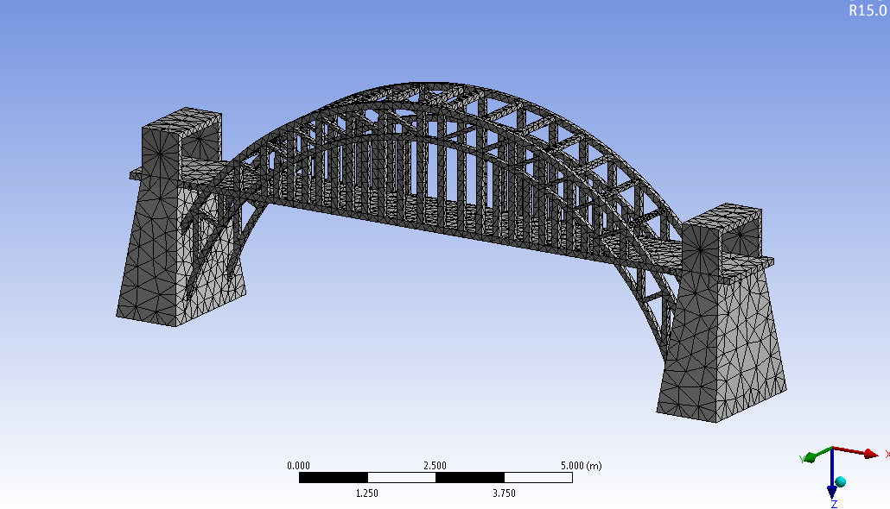
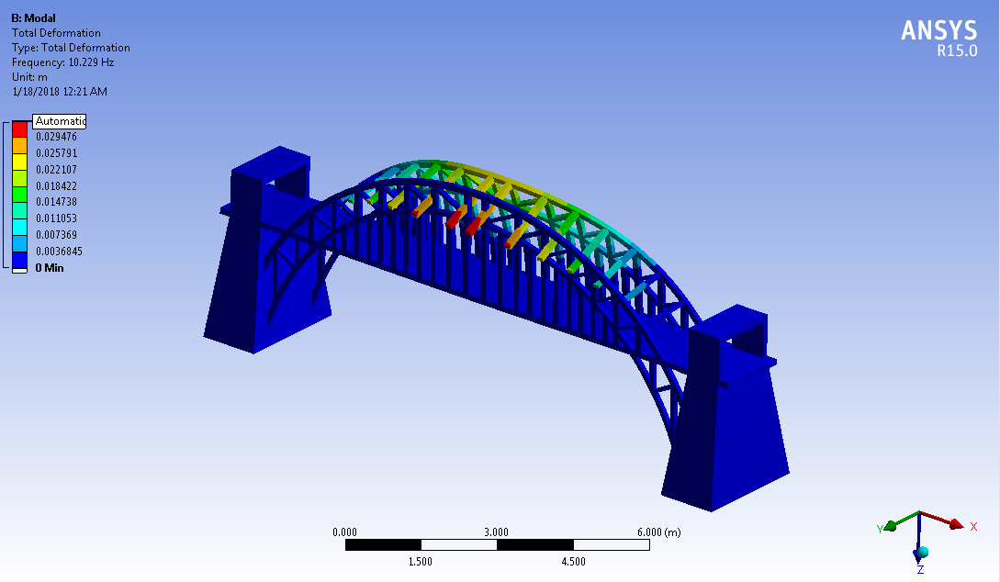
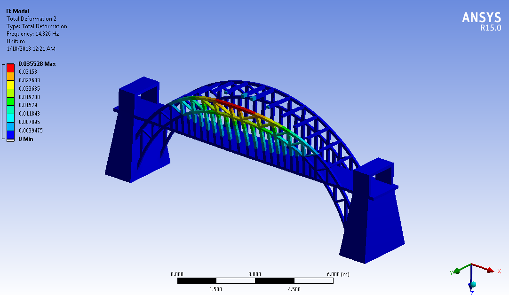
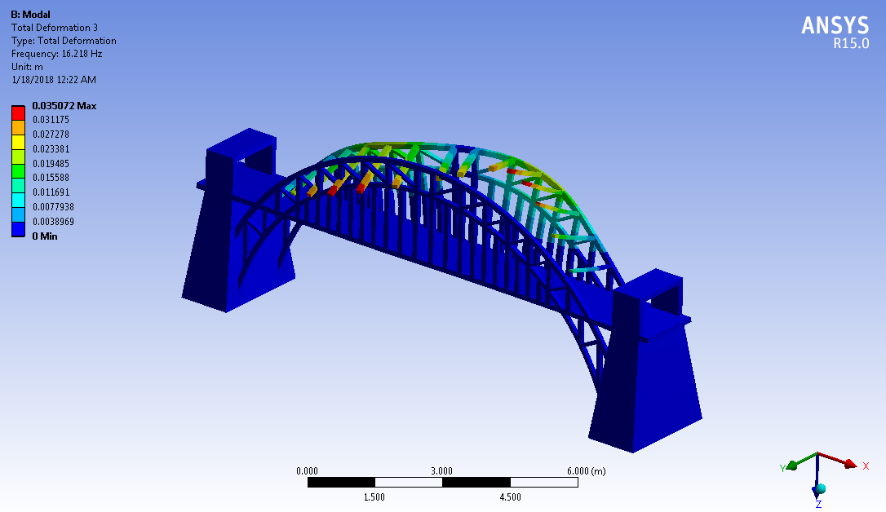
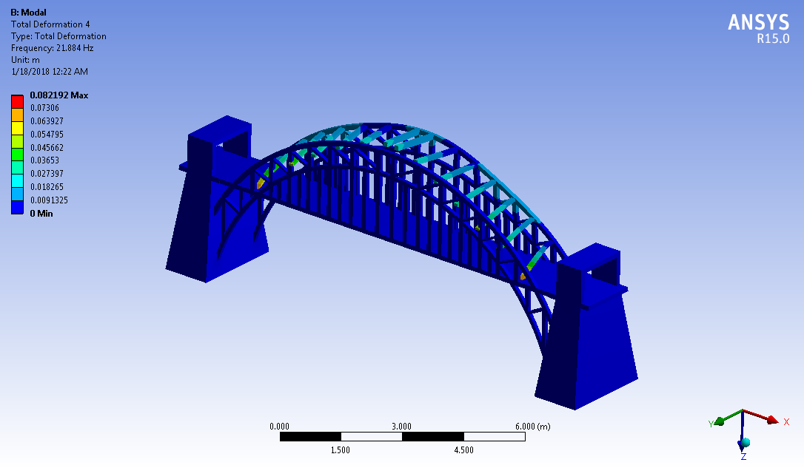
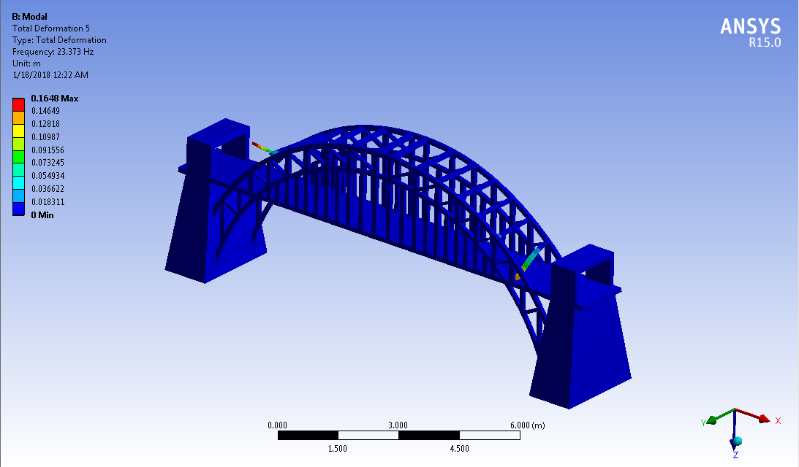
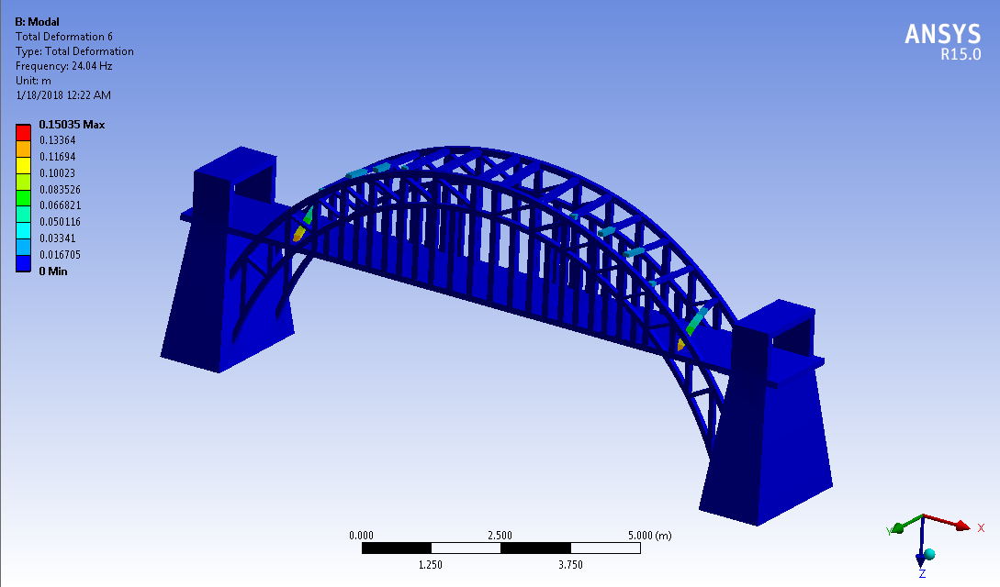

# Finite Element Analysis: Sydney Harbour Bridge
### Multi-Physics Simulation using ANSYS Workbench

> **Software:** ANSYS Workbench v14.5 / v15.0, ANSYS Fluent, ANSYS Mechanical, Creo Parametric 2.0  
> **Year:** 2018

---

## Overview

This project presents a complete multi-physics finite element analysis of the Sydney Harbour Bridge, covering three coupled simulation domains:

| Analysis Type | Tool | Purpose |
|---|---|---|
| Fluid Flow (CFD) | ANSYS Fluent | Wind load characterization |
| Static Structural | ANSYS Mechanical | Stress & deformation under load |
| Modal Analysis | ANSYS Mechanical | Natural frequency extraction |

The bridge geometry was modelled in **Creo Parametric 2.0** and exported as an IGES file, then imported into ANSYS Workbench for meshing and multi-physics analysis.

---

## Mesh

A fine mesh was applied across the full bridge geometry to ensure solution accuracy. Element edge length was refined from **97.5 mm to 21.6 mm** in critical regions.



---

## Analysis 1: Fluid Flow (CFD)

**Objective:** Simulate aerodynamic loading on the bridge structure from steady-state wind.

**Setup:**
- Fluid medium: Air (incompressible, laminar)
- Inlet velocity: **25 m/s** (perpendicular to bridge face)
- Outlet: Pressure outlet at 0 Pa gauge
- Wall material: Aluminium at 300 K
- Iterations: 20 (converged)

**Key Results:**
- Maximum velocity in flow field: **42.49 m/s**, concentrated under the span and around arch sides, consistent with expected flow acceleration around bluff bodies.

%20ANALYSIS.png)

---

## Analysis 2: Static Structural

**Objective:** Evaluate stress and deformation response under a representative service load.

**Setup:**
- Material: Structural Steel (E = 200 GPa, rho = 7850 kg/m3, sigma_y = 250 MPa, sigma_u = 460 MPa)
- Applied load: **50 kN** on bridge platform
- Total structure mass: **120,018 kg**
- Boundary conditions: Fixed abutments at both ends

**Key Results:**

| Quantity | Maximum | Location |
|---|---|---|
| Von Mises Stress | **176.67 kPa** | Lower arch near supports |
| Von Mises Strain | **8.79 x 10^-7** | Lower arch near abutments |
| Total Deformation | **9.35 um** | Beams supporting the arch |

The maximum stress is far below the steel yield limit of 250 MPa, confirming structural integrity under the applied load. Fixed abutments show zero deformation as expected.

**Total Deformation**


**Von Mises Stress**


**Von Mises Strain**


---

## Analysis 3: Modal Analysis

**Objective:** Extract the natural frequencies and mode shapes to assess dynamic behaviour and resonance risk.

**Setup:**
- 6 modes extracted
- Same structural steel material and boundary conditions as static analysis

**Mode Shapes:**

| Mode | Visualization |
|---|---|
| Mode 1 |  |
| Mode 2 |  |
| Mode 3 |  |
| Mode 4 |  |
| Mode 5 |  |
| Mode 6 |  |

Each mode shape reveals distinct deformation patterns across the arch and truss members, providing insight into the structure's dynamic vulnerability zones.

---

## Repository Structure

```
sydney-harbour-bridge-fem-analysis/
├── README.md
└── images/
    ├── MESH.PNG                                         # Mesh visualization
    ├── FLUID FLOW (FLUENT) ANALYSIS.png                 # CFD velocity streamlines
    ├── Total Deformation.png                            # Static structural: total deformation
    ├── STATIC STRUCTURAL ANALYSIS Von-Mises Stress.png  # Static structural: von Mises stress
    ├── STATIC STRUCTURAL ANALYSIS Von-Mises Strain.png  # Static structural: von Mises strain
    ├── 1st.PNG                                          # Modal mode shape 1
    ├── 2nd.PNG                                          # Modal mode shape 2
    ├── 3rd.PNG                                          # Modal mode shape 3
    ├── 4th.PNG                                          # Modal mode shape 4
    ├── 5th.PNG                                          # Modal mode shape 5
    └── 6th.PNG                                          # Modal mode shape 6
```

---

## Workflow

```
Creo Parametric 2.0
        |
        v  (IGES export)
ANSYS Workbench
        |
        |---> ANSYS DesignModeler --> Geometry import & cleanup
        |
        |---> Meshing --> Fine mesh (edge length: ~21.6 mm)
        |
        |---> ANSYS Fluent --------> CFD: Wind velocity field, max 42.49 m/s
        |
        |---> ANSYS Mechanical ----> Static: Max stress 176.67 kPa, defl. 9.35 um
        |
        └---> ANSYS Mechanical ----> Modal: 6 natural frequencies & mode shapes
```

---

## Skills Demonstrated

- **CAD Modelling:** 3D geometry creation and IGES export in Creo Parametric
- **Meshing:** Structured mesh generation and refinement strategy in ANSYS
- **Computational Fluid Dynamics:** Steady-state incompressible flow simulation in ANSYS Fluent
- **Structural FEA:** Linear static analysis covering stress, strain, and deformation under load
- **Vibration / Modal Analysis:** Frequency extraction and mode shape visualisation
- **Engineering Validation:** Results benchmarked against material limits and physical expectations
- **Technical Reporting:** Documented methodology, results, and conclusions in a formal engineering report

---

## Author

**Muhammad Irtaza Khan**
<!-- _ka:4 -->
